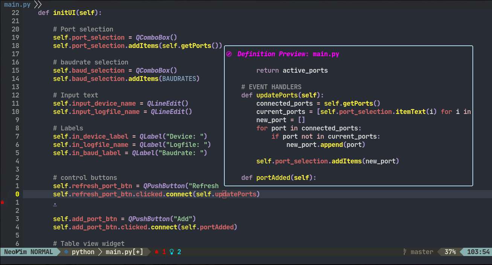
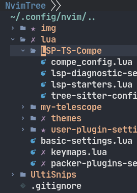
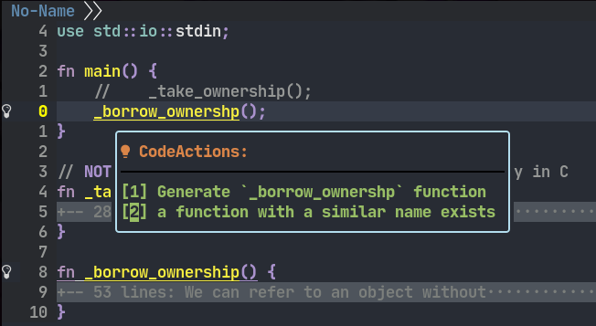
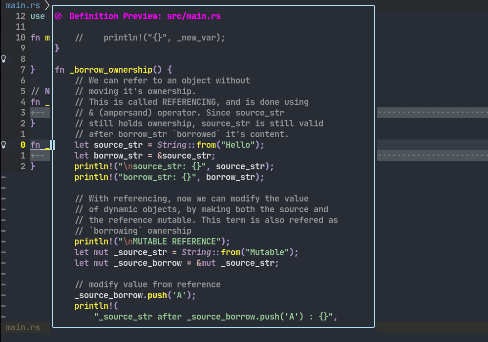
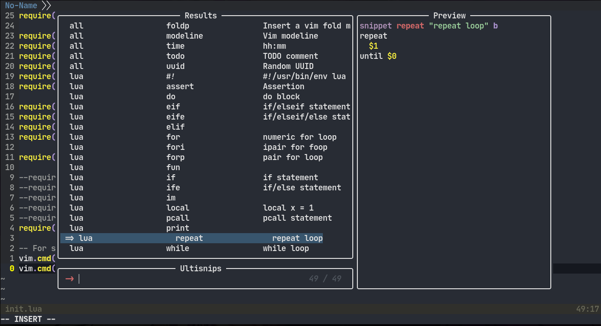
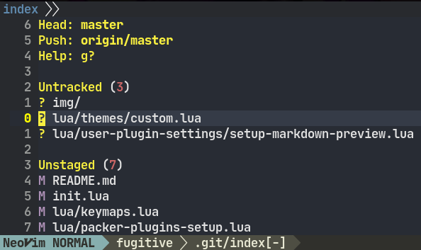
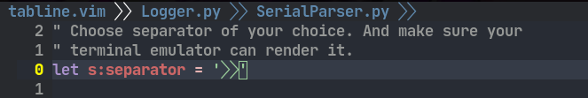
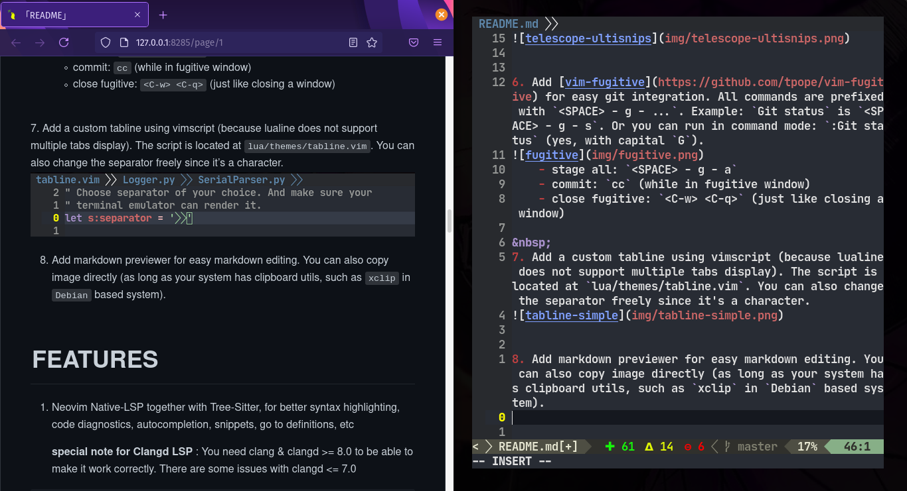
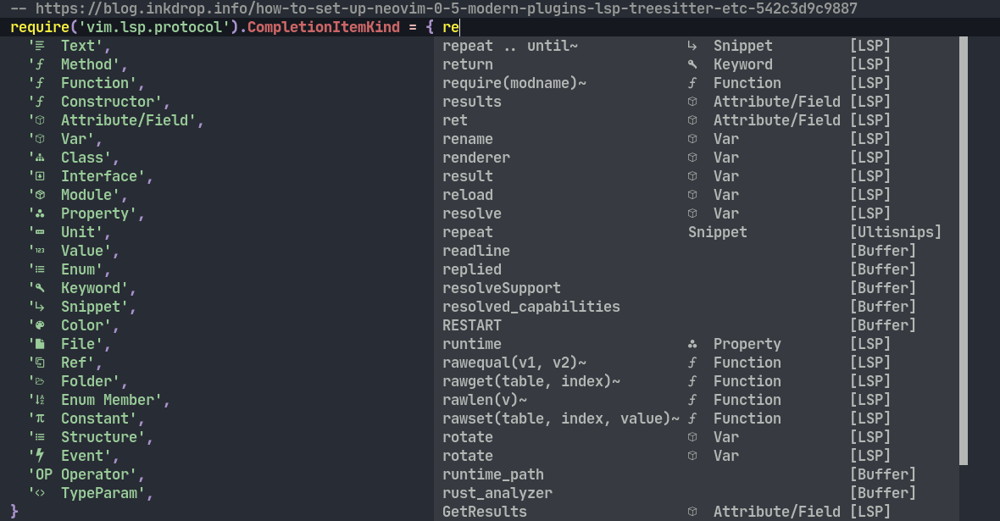

# Neovim >= 0.5.0 Configuration files in Lua
2 Top themes  
Aurora by ray-x (a bit heavy on my eyes though):

  
  
Gruvbuddy by tjdevries :  



# Whats new (30-7-2021):  
1. For file browser, changed [nerdtree](https://github.com/preservim/nerdtree) to [nvim-tree](https://github.com/kyazdani42/nvim-tree.lua) which looks nicer and supports icons.  



&nbsp;   
2. For statusline, changed [vim-airline](https://www.url.com) to [lualine.nvim](https://github.com/hoob3rt/lualine.nvim) because the lualine is faster to load. Read [this](https://github.com/hoob3rt/lualine.nvim#performance-compared-to-other-plugins) for more info on comparison between `lualine.nvim` and `vim-airline`. The `lualine.nvim` is easily customizable too. Currently, it's set to show: `mode`, `filename & filetype`, `LSP diagnositcs (errors, warnings, etc)`, `git diff`, `git branch`, `location`


&nbsp;   
3. Added [gruvbuddy.nvim](https://github.com/tjdevries/gruvbuddy.nvim) for new casual theme.


&nbsp;   
4. Improve LSP UI with [lspsaga](https://github.com/glepnir/lspsaga.nvim). Now the LSP functionalities looks nicer. Here are some shot:




&nbsp;   
5. Added snippet engine for some lazy typer like me. Using [UltiSnips](https://github.com/SirVer/ultisnips) which can also add user defined snippets. You can also list snippets using Telescope using `<SPACE> - t - u`, will insert snippet on `<CR>`



&nbsp;   
6. Add [vim-fugitive](https://github.com/tpope/vim-fugitive) for easy git integration. All commands are prefixed with `<SPACE> - g - ...`. Example: `Git status` is `<SPACE> - g - s`. Or you can run in command mode: `:Git status` (yes, with capital `G`).

    - stage all: `<SPACE> - g - a`
    - commit: `cc` (while in fugitive window)
    - close fugitive: `<C-w> <C-q>` (just like closing a window)

&nbsp;   
7. Add a custom tabline using vimscript (because lualine does not support multiple tabs display). The script is located at `lua/themes/tabline.vim`. You can also change the separator freely since it's a character.
  
  

&nbsp;  
8. Add markdown previewer for easy markdown editing. You can also copy image directly (as long as your system has clipboard utils, such as `xclip` in `Debian` based system).

- Toggle previewer: `<SPACE> - m - p`
- Paste image from clipboard: `<SPACE> - m - i`, you will be prompted to insert image name, without `.png` extension!


&nbsp;  
9. Completion menu now has a nice symbols like VSCode and many other Text Editors. You can also edit it however you like at `lua/LSP-TS-Compe/lsp-starters.lua`



&nbsp;  
# FEATURES
1. Neovim Native-LSP together with Tree-Sitter, for better syntax highlighting, code diagnostics, autocompletion, snippets, go to definitions, etc  
  
    **special note for Clangd LSP** : You need clang & clangd >= 8.0 to be able to make it work correctly. There are some issues with clangd <= 7.0
```vim
" go-to-definition : gd
" go-back to last file (spam able) : CTRL + O  or CTRL + T
" show documentation : SHIFT + K
```


2. Floating terminal using LSP saga
```vim
" Open Floaterm terminal: SPACE - f - t
" Close Floaterm terminal: ESC-ESC
```


  
3. Neovim-Telescope for amazing file navigation, git navigation (branches, files, commits, etc), code diagnostics, vim quickfixes
```vim
" All Telescope commands are prefixed with : SPACE - t - ....
```


4. Variety of popular theme selection pre-installed. Choose 1 of them which suites your taste.
```lua
--require('themes.my-themes').set_aurora()
--require('themes.my-themes').set_monokai()
--require('themes.my-themes').set_ayu("mirage")
--require('themes.my-themes').set_tokyonight("night")
--require('themes.my-themes').set_codedark()
require('themes.my-themes').set_custom()  --custom of tjdevries/gruvbuddy.nvim
```


5. Integrated CMake plugin. Press SPACE-c-g to generate build files, and SPACE-c-b to build the project! (CMakeGenerate will look CMakeLists.txt in the root directory, and also respecting .gitignore & .git). If you want to enable clangd LSP support, you have to add this line in your main CMakeLists.txt file:
```cmake
set(CMAKE_EXPORT_COMPILE_COMMANDS ON)
```
This will generate file named 'compile_commands.json', which tells the clangd LSP how your project looks like, how your include dirs are arranged, what   libraries you used, etc. Without this, clangd may not behave properly.  
```vim
" Generate build files from root CMakeLists.txt: SPACE - c - g  
" Build project from build files: SPACE - c - b  
" Close CMake window: SPACE - c - q  
```
6. And many more! You can read all through the config files if you want to utilize the full potential of Neovim 0.5.0. If you want more info, read the `lua/keymaps.lua` file for list of keymaps.
  
&nbsp;  
  
# INSTALLATION
1. Get this requirements (If you want to add more language servers, see nvim-lspconfig [CONFIG.md](https://github.com/neovim/nvim-lspconfig/blob/master/CONFIG.md) for more information).
```
- Install Neovim 0.5.0 official release. You have to either:
        - Install from source, there is an appimage available.
        - Build from source, and install globally
After that configure it so Neovim 0.5.0 is accessible globally by creating a link & adding the path.
        ln -S -T /path/to/nvim0.5.0/binary ~/bin/       #assuming ~/bin/ is in $PATH
Or if you built from source, usually they will provide a Makefile to install globally.
        sudo make install
otherwise, you can always use link method

- Install via your package manager: node, python3, python3-pip, gcc, g++, clang, node, clangd, git, ripgrep
   (in my case: apt)
- Install via pip: cmake-language-server
- Install via npm (global installation): vim-language-server, bash-language-server, pyright
  (UNIX based systems have to install as root)

- For Lua language server, it's a bit complicated, but I recommend you following these guide:  
        https://github.com/sumneko/lua-language-server/wiki/Build-and-Run-(Standalone)  

- For my Neovim (particular) config, clone the the sumneko's lua-language-server repo (^) in your ~/bin directory.
  (IMPORTANT: ~/bin/ must be in $PATH)
        ex: 
        mkdir ~/bin
        cd ~/bin/ ; git clone https://github.com/sumneko/lua-language-server

        after that, follow the build step and do it in ~/bin
```


&nbsp;  
2. Clone this repository:
```bash
# do this first, we will change the directory name later
git clone https://github.com/yeyee2901/yy-neovim-config ~/.config/nvim
```


&nbsp;  
3. NOW, the main difference with this LUA config counterpart, compared to vimscript counterpart,
This will automatically install 'packer' plugin manager, and install all the plugins specified.

&nbsp;  
4. If it succeeds, then it should automatically install the required plugins!  


&nbsp;  
5. Try opening any file and either press ' SPACE-t-f ', or running this command in neovim:
```vim
:Telescope find_files
```


&nbsp;  
6. If you're messing up something, you can watch ChrisAtMachine / TJ DeVries videos & livestreams. They provide
clear explanation on these setups. Regarding LSP setups, do watch ChrisAtMachine's video: https://www.youtube.com/watch?v=NXysez2vS4Q&t=915s
  
&nbsp;  
# SNAPSHOTS
1. Code snippets, autocompletes on Tab, and if the function is not yet defined, it tries to auto import the module. (see big dots beside the text). Navigate with Ctrl+n & Ctrl+p


2. Here are some of Telescope capabilities.Telescope will try to search all occurences of your search query, and you can immediately jump on ENTER. Of course you can also go back to previous file using CTRL + o from LSP keymapping.


Telescope the quickfix list! ( SPACE-t-q-f ) - To generate quickfix lists, run these command (in command mode :)
```
vimgrep /your_search_query/g ./file_to_search'

EXAMPLE: this will tell neovim to : 'search all 'def' occurence in the current directory, for all files that end with ".py" '
vimgrep /def/g ./*.py
```


Telescope the diagnostics! (for current document only, the workspace diagnostics seems buggy) ( SPACE-t-l-d-d)


Forgot keymap / shortcuts? No Problemo! ( SPACE-t-? )


3. Integrated CMake building & file generator


&nbsp;  

# NOTES
I do not own any of the plugins, softwares, etc. I just arranged them to be suitable for my development needs,
mainly for embedded systems and a little bit of Python. Feel free to download this repo and try exploring with Neovim >= 0.5.0! HAPPY VIMMING!!  
  
Tested On:
1. Pop! OS 21.04 (debian based)
2. Raspbian (buster) @Raspberry Pi 4 model B (8GB RAM)

